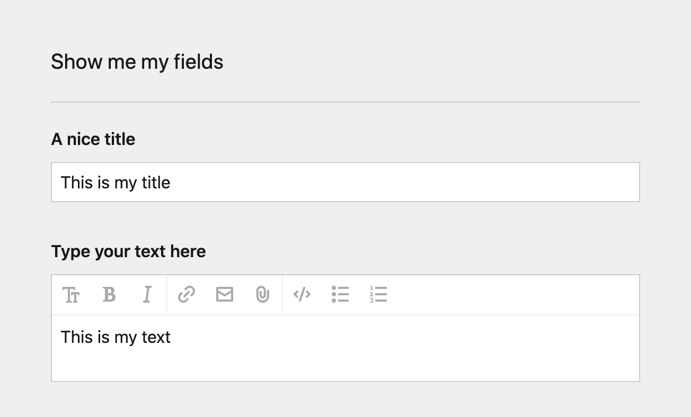

# Fieldset
Panel field which loads a fieldset and stores the values in a single field as yaml.

This works like an extend with the difference that all all values from the fieldset fields are store in a single field. This way you van reuse the fieldset and bind it to a snippet: `snippet('mySnippet', $page->the_fieldset()->yaml())`

## Usage
Create a blueprint with a fieldset:

site/blueprints/fieldsets/somefields.yml
```
fields:
  title:
    type: text
    label: A nice title
  text:
    type: textarea
    label: Type your text here
```

In your page yml add the fieldset field and point it to the fieldset blueprint:

site/blueprints/pages/default.yml
```
fields:
  myfields:
    type: fieldset
    blueprint: fieldsets/somefields
    label: Show me my fields
```

In the panel the fields from somefields.yml are loaded in the fieldset field:



The data is stored as yml in the txt file:

```
----

Myfields:

title: This is my title
text: This is my text

```

## Using the values in templates
There are 2 ways to easily access the values stored in the fieldset field. There is a supplied chainable method or it's yaml can be decoded with the native yaml method or even passed 


### 1. Using the supplied fieldmethod
The plugin introduces a field method to make the values accessible as regular chainable kirby fields:
```
<h1><?= $page->myfields()->fieldset()->title() ?></h1>
<?= $page->myfields()->fieldset()->text()->kirbytext() ?>
```

### 2. Yaml decode by hand
In the template the data is accessible as array by yaml decoding it:

default.php
```
<?php foreach ($page->myfields()->yaml() as $key => $value): ?>
  <p><?= $key ?> – <?= $value ?></p>  
<?php endforeach ?>
```

Once decoded the values can be directly passed to a snippet:
```
<?php snippet('mySnippet', $page->myfields()->yaml()) ?>
```

site/snippets/mySnippet.php
```
<h2><?= $title ?></h2>
<?= kirbytext($text) ?>
```

## License
[MIT
